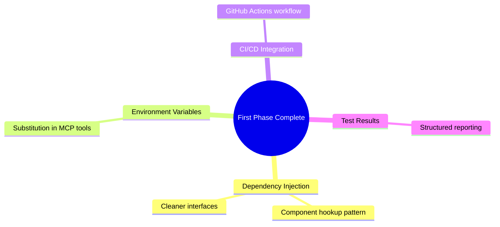
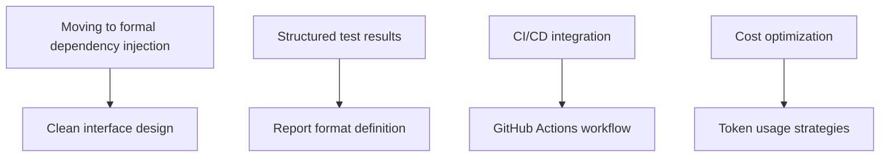

# Active Context: Aethr

## Current Focus

## Recent Changes

- Advanced to release candidate stage with version 1.0.0-rc.7
- Completed core end-to-end functionality with CLI → Agent → Browser automation
- Finalized multi-LLM support with comprehensive provider options
- Solidified metrics and usage tracking with cost calculation
- Finalized terminal UI with Pino logger and pretty formatting
- Implemented workaround for browser_close handling in Playwright MCP

## Next Steps

1. Create dependency injection for metrics and logger components
2. Improve test result reporting structure
3. Integrate GitHub Actions CI/CD
4. Optimize token usage for reduced costs
5. Enhance error handling for edge cases
6. Develop structured output formats for machine consumption
7. Add report generation option

## Active Decisions

- **UI Framework**: Pino logger provides better flexibility and output formatting
- **Metrics Tracking**: Validated approach to token usage and cost calculation across multiple LLM providers
- **Module Structure**: Established clean interfaces between components with future DI approach planned
- **Configuration**: Separate configuration file for MCP servers
- **Browser Automation**: Implemented workaround for browser_close handling in Playwright MCP
- **Additional CLI Options**: Added temperature control, think-tool toggle, and reasoning parameter options

## Important Patterns

- TypeScript with strict mode for all code
- Modular architecture with clean interfaces
- Configuration file for MCP tools
- Environment variable-based configuration for models
- Promise-based async flow for all operations
- EventEmitter-based metrics collection and reporting
- TokenStream handling for real-time agent output

## Technical Insights

- Pino logger provides a good balance of simplicity and flexibility for terminal UI
- EventEmitter is effective for decoupling metrics collection from reporting
- Token usage tracking enables cost optimization strategies
- Line tracking in logger improves readability of streamed output

## Open Questions

- Best format for structured test reporting
- Optimization strategies for token usage
- Integration approaches for CI/CD pipelines

## Recent Achievements

- Advanced to release candidate stage with version 1.0.0-rc.7
- Added CLI options for fine-tuning agent behavior (temperature, think-tool, reasoning)
- Completed core end-to-end functionality with CLI → Agent → Browser automation
- Finalized multi-LLM support with comprehensive provider options

## Current Challenges

- Moving from direct component initialization to dependency injection pattern
- Defining structured test result format for consistent reporting
- Designing HTML report templates for better visualization
- Implementing GitHub Actions workflow for CI/CD
- Developing strategies for token usage optimization across providers

## Development Environment

- Node.js v22+ with TypeScript
- Multiple LLM providers (OpenAI, Anthropic, Google, etc.)
- Playwright MCP for browser automation
- Pino logger for terminal output
- Environment variables for configuration
