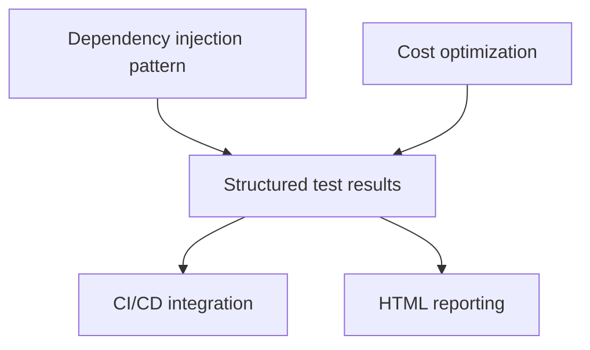

# Progress: Aethr

## Status Overview

- **Phase 1 Complete & RC Stage (v1.0.0-rc.7)**: Core framework with end-to-end functionality including CLI parser, ReAct agent, MCP integration, terminal UI, metrics tracking, environment variable substitution, CLI options for fine-tuning, and error handling
- **Phase 2 Planned**: Dependency injection, CI/CD integration, structured test reporting, cost optimization

## Implementation Milestones

| Component                | Status      | Notes                                                 |
| ------------------------ | ----------- | ----------------------------------------------------- |
| **CLI Parser**           | ✅ Complete | Commander.js with file validation and command options |
| **ReAct Agent**          | ✅ Complete | LangGraph-based with multiple LLM provider support    |
| **MCP Integration**      | ✅ Complete | Playwright tools with browser lifecycle management    |
| **Error Handling**       | ✅ Complete | Contextual errors with proper recovery strategies     |
| **Terminal UI**          | ✅ Complete | Pino logger with pretty formatting and line handling  |
| **Metrics & Usage**      | ✅ Complete | Token tracking and cost calculation for all providers |
| **CLI Options**          | ✅ Complete | Temperature, think-tool, and reasoning parameters     |
| **Dependency Injection** | 🔄 Planned  | Clean component interfaces and hookup                 |
| **Cost Optimization**    | 🔄 Planned  | Token usage reduction strategies across providers     |
| **CI/CD**                | 🔄 Planned  | GitHub Actions workflow for testing and publishing    |
| **Test Results**         | 🔄 Planned  | Structured reporting with consistent format           |

## Status Summary

- Project has advanced to release candidate stage (v1.0.0-rc.7)
- All core functionality is working end-to-end: CLI → Agent → Browser automation
- Multiple LLM providers successfully integrated with usage tracking
- Terminal output refined with Pino logger and pretty formatting
- Module isolation improved with cleaner component interfaces
- Metrics collection and reporting properly implemented
- Example test scenarios working correctly

## Key Decisions

- **Architecture**: Modular design with clean component interfaces
- **Stack**: Node.js v22+/TypeScript (strict) + LangChain/LangGraph + Playwright MCP
- **LLM Support**: Factory pattern with extensive provider options (OpenAI, Anthropic, Google, AWS, etc.)
- **UI Framework**: Pino logger with pretty formatting (replacing planned Listr2)
- **Metrics**: Comprehensive token usage tracking and cost calculation
- **Error Handling**: Contextual errors with recovery strategies

## Current Blockers

- No major blockers for phase 1 completion
- Phase 2 planning underway with clear priorities

## Implementation Details

### Completed (Phase 1)

**CLI Bootstrap**

- Command structure with Commander.js
- Test file loading and validation
- CLI options for fine-tuning agent behavior:
  - Temperature control for LLM
  - Think-tool toggle for explicit reasoning
  - Reasoning parameter for MCP tools
- Error handling for file operations

**ReAct Agent**

- LangGraph-based implementation with tool registration
- Full multi-LLM support via factory pattern for all major providers:
  - OpenAI and Azure OpenAI
  - Anthropic
  - Google (Gemini and VertexAI)
  - AWS Bedrock
  - Groq
  - Cohere
  - Ollama
  - OpenRouter
- System prompt with browser automation instructions
- Real-time streaming of agent reasoning to terminal
- Recursion limit control to prevent infinite loops

**MCP Integration**

- Playwright MCP client for browser automation
- Tool registration and mapping via adapters
- Connection lifecycle management
- Workaround for browser_close handling

**Terminal UI**

- Pino logger with pretty formatting
- Custom token streaming for real-time agent outputs
- Colored output with proper symbols
- Line tracking for consistent formatting
- Error highlighting and context

**Metrics & Usage**

- Comprehensive token usage tracking for input/output
- Cost calculation based on provider-specific pricing
- Usage reporting both during and after execution
- EventEmitter-based collection and reporting

**Error Handling**

- Contextual errors with step information
- Recovery strategies for common failures
- Proper exit code handling for CI/CD integration
- Detailed logging of error context

### Planned (Phase 2)

- **Dependency Injection**: Clean component interfaces and hookup
- **Cost Optimization**: Strategies for reducing token usage and API costs
- **Test Results**: Structured format for consistent reporting
- **CI/CD**: GitHub Actions workflow for testing and publishing
- **HTML Reports**: Visual representation of test execution
