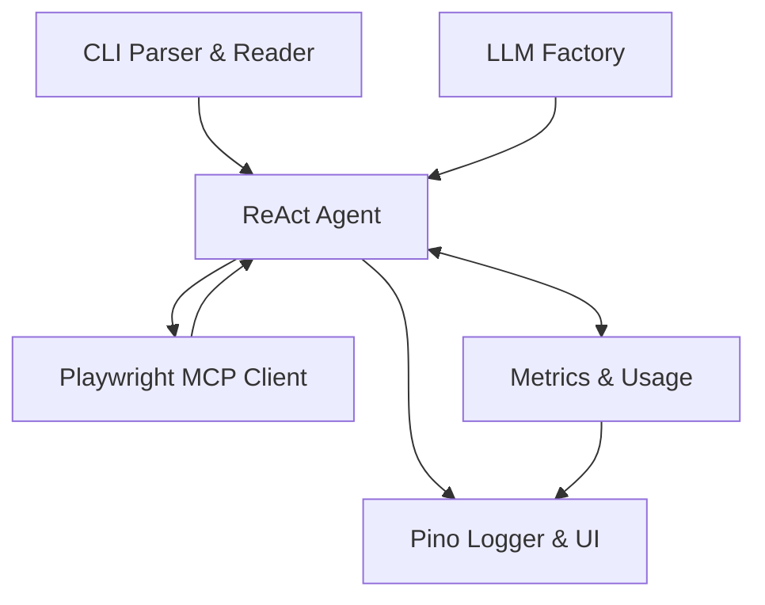

# System Patterns: Aethr

## Architecture Overview

Modular pipeline architecture with ReAct agent core for natural language test interpretation, comprehensive metrics tracking, and multi-LLM provider support.

The implemented architecture follows this pattern with:

1. CLI parsing test files and validating input
2. ReAct Agent interpreting natural language and making browser automation decisions
3. Playwright MCP Client handling browser actions
4. Pino Logger providing terminal UI with streaming updates
5. Metrics & Usage tracking token consumption and calculating costs
6. LLM Factory providing model selection based on environment variables

The architecture provides clean component boundaries with plans to formalize interfaces through dependency injection in Phase 2.

## Key Components

1. **CLI Interface**: ✅ Implemented using Commander.js with:

   - `run` command for test execution
   - File validation and error handling
   - Command-line options including:
     - Verbosity control
     - Recursion limit setting
     - Temperature adjustment
     - Think-tool toggle for explicit reasoning
     - MCP tool reasoning parameter
     - Configuration file selection
     - Profile selection

2. **ReAct Agent**: ✅ Implemented using LangChain/LangGraph with:

   - Multiple LLM provider support (OpenAI, Anthropic, Google, AWS, etc.)
   - Tool registration and mapping
   - Streaming output for real-time feedback
   - Recursion limit to prevent infinite loops

3. **Playwright MCP Client**: ✅ Implemented with:

   - Browser automation tools
   - Proper lifecycle management
   - Workaround for browser_close handling
   - Adapter pattern for tool mapping

4. **Terminal UI**: ✅ Implemented using Pino logger with:

   - Pretty formatting for readability
   - Custom token streaming for real-time updates
   - Colored output with proper symbols
   - Line tracking for consistent formatting

5. **Metrics & Usage**: ✅ Implemented with:
   - Token usage tracking for all providers
   - Cost calculation based on provider-specific pricing
   - EventEmitter-based collection and reporting
   - Both per-request and aggregate metrics

## Design Patterns

1. **ReAct Pattern**: ✅ Implemented the Reasoning → Action → Observation loop via LangGraph's createReactAgent for:

   - Natural language understanding
   - Step-by-step reasoning
   - Action selection and execution
   - Observation processing

2. **Adapter Pattern**: ✅ Implemented via @langchain/mcp-adapters to:

   - Translate between agent and MCP tools
   - Handle different tool input/output formats
   - Provide consistent interfaces

3. **Observer Pattern**: ✅ Implemented via EventEmitter for:

   - Token usage metrics tracking
   - Real-time output streaming
   - Progress monitoring
   - Cost calculation

4. **Factory Pattern**: ✅ Implemented for LLM selection with:

   - Support for multiple providers
   - Environment variable configuration
   - Fallback mechanisms
   - Provider-specific options

5. **Chain of Responsibility**: ✅ Enhanced error handling with:

   - Contextual error information
   - Recovery strategies
   - Logger integration
   - Exit code handling

6. **Dependency Injection**: 🔄 Planned for Phase 2 to provide:
   - Cleaner component hookup
   - Testability improvements
   - Flexibility for different implementations

## Data Flow

1. **Input**: ✅ CLI reads test file → validates → passes to ReAct agent as user message

   - File path validation
   - Content reading
   - Error handling

2. **Processing**: ✅ Agent breaks down scenario into steps → reasons → decides actions

   - Natural language parsing
   - Intent identification
   - Multi-step planning
   - Decision making

3. **Execution**: ✅ MCP client sends commands → browser acts → returns results

   - Browser automation
   - Action execution
   - Response handling
   - Error recovery

4. **Metrics Collection**: ✅ Agent provides usage data → Metrics component calculates costs

   - Token counting
   - Provider-specific pricing
   - Aggregation
   - Summary generation

5. **Reporting**: ✅ Metrics forwards data to Pino logger → formatted output
   - Real-time updates
   - Final summary
   - Token usage reporting
   - Cost calculation display

## Error Handling Patterns

1. **Graceful Degradation**: Continue despite non-critical errors

   - Retry mechanisms
   - Fallback options
   - Partial success handling

2. **Contextual Errors**: Include step, intent, and technical details

   - Error classification
   - Detailed messaging
   - Cause identification
   - Stack trace when relevant

3. **Recovery Strategies**: Attempt alternative approaches on failure
   - Different selectors
   - Timing adjustments
   - Simplified actions
   - User-friendly explanations

## State Management

1. **Immutable Transitions**: New state each step for traceability

   - LangGraph state nodes
   - Step-by-step tracking
   - Clear progression
   - Decision history

2. **Context Object**: Maintains history for decision-making
   - Previous actions
   - Observations
   - Analysis results
   - Error context

## Extension Points

1. **Custom Reporters**: Planned enhancement for Phase 2

   - HTML report generation
   - JSON output format
   - CI/CD integration
   - Visual test results

2. **Multi-LLM Support**: ✅ Implemented with environment variables for:

   - OpenAI and Azure OpenAI
   - Anthropic
   - Google (Gemini and VertexAI)
   - AWS Bedrock
   - Groq
   - Cohere
   - Ollama
   - OpenRouter

3. **CI/CD Integration**: 🔄 Planned for Phase 2

   - GitHub Actions workflow
   - Pipeline integration
   - Exit code handling
   - Automated reporting

4. **Test Processors**: 🔄 Planned for future enhancement
   - Pre-processing hooks
   - Post-processing analysis
   - Result transformation
   - Custom validators

## Key Technical Choices

1. **Framework Selection**: Selected technologies that provide the best balance of flexibility, features, and developer experience for the specific requirements of natural language test interpretation.

2. **Architecture Trade-offs**: Made intentional decisions about component boundaries that prioritize clear interfaces while acknowledging future refactoring needs through planned dependency injection patterns.

3. **Technology Stack**:

   - **LangChain/LangGraph**: Leverages ReAct pattern for complex reasoning
   - **Playwright MCP**: Provides reliable browser automation
   - **Pino Logger**: Chosen over Listr2 for better output control
   - **EventEmitter**: Enables decoupled metrics tracking

4. **Future Evolution**:
   - Current direct component initialization is slated for migration to dependency injection
   - Extension points have been identified for Phase 2 enhancements
   - Metrics collection framework enables future optimization strategies
