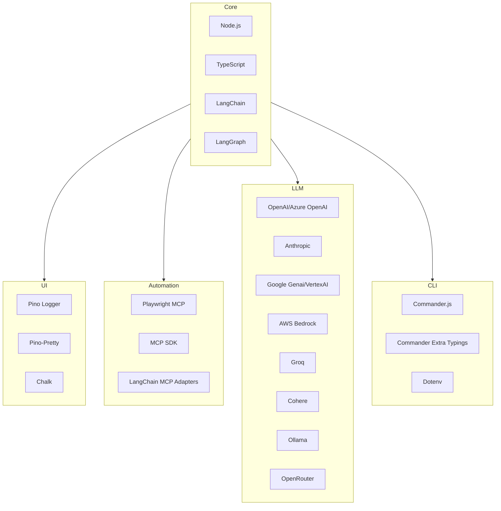
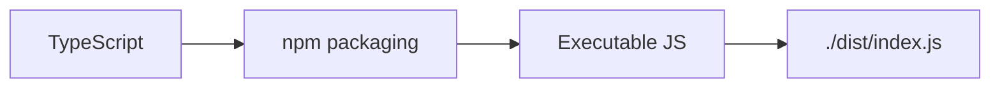
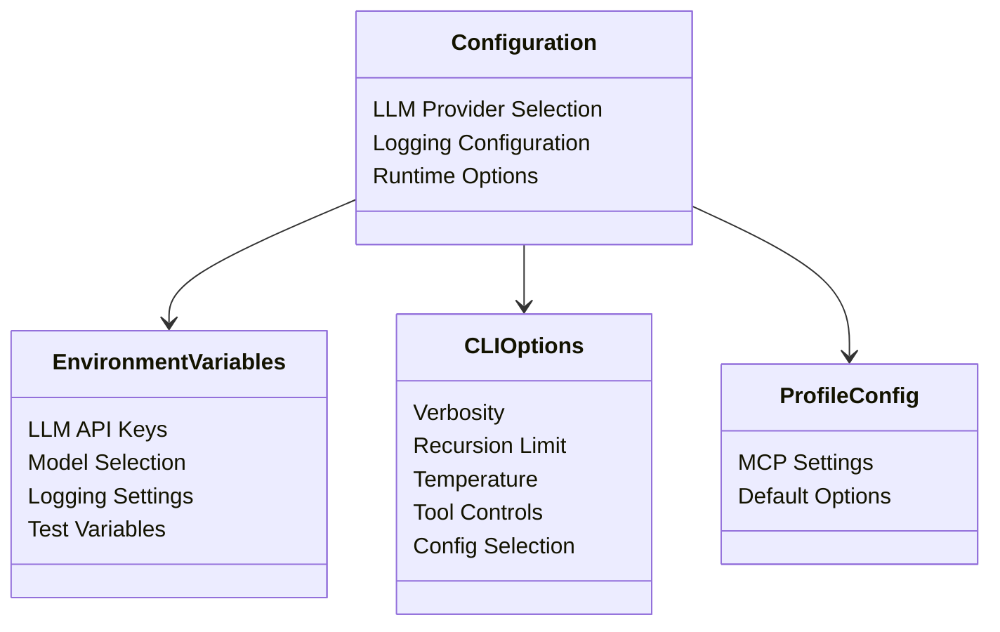

# Technical Context: Aethr

## Technology Stack

- **Core**: Node.js with TypeScript (strict mode), LangChain/LangGraph for ReAct agent
- **Automation**: Playwright MCP with adapters for browser control
- **UI**: Pino logger with pretty formatting and colored output
- **LLM Providers**: Multi-provider support including OpenAI, Anthropic, Google, AWS, Groq, Cohere, Ollama, and OpenRouter
- **CLI**: Commander.js with environment variable support via Dotenv

## Development Environment

- Modern Node.js runtime with TypeScript
- ESLint and Prettier for code quality
- Git hooks via Husky/lint-staged
- Vitest for testing
- ES Modules throughout

## Build Process

- TypeScript compilation with npm packaging
- ES Modules for better tree-shaking
- Executable distribution via CLI binary

## Testing Approach

- Unit testing with Vitest (Not done yet)
- E2E testing via examples directory
- Local Playwright MCP server required for testing

## Performance Considerations

- Streaming responses for real-time feedback
- Efficient agent context management
- Asynchronous processing throughout
- Token usage tracking and optimization
- EventEmitter-based metrics collection

## Security Model

- Environment variable-based secret management
- No persistent storage of test scenario data
- Input validation for all user-provided data
- Proper error handling with detailed context

## Configuration System

## Environment Variables

- LLM API keys and model selection for all providers
- Logging configuration
- Test scenario variable substitution

## CLI Options

- Verbosity control
- Recursion limit for agent
- Temperature adjustment for LLM
- Think-tool and reasoning parameter toggles
- Configuration file and profile selection

## External Dependencies

- **LLM APIs**: Multiple providers with varying rate limits and pricing
- **Browser Automation**: Playwright MCP for reliable control
- **Runtime Environment**: Node.js v22+ required

## Key Constraints

- API latency affects performance
- Browser automation timing challenges
- Environment variable management complexity
- Natural language interpretation limitations
